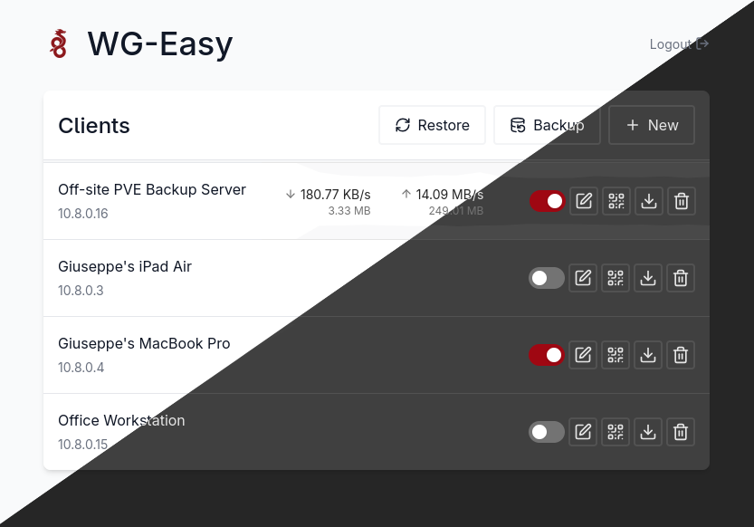

# WireGuard Easy

A refined fork of [WireGuard Easy](https://github.com/wg-easy/wg-easy) **v14** optimized for configuration management.

**Core Philosophy:** This version decouples the management UI from the WireGuard implementation. It is designed for environments—such as rootless Podman or bare-metal deployments under non-root users—where you lack the necessary privileges to manage kernel interfaces, but still require a clean, modern UI to generate and maintain your configuration.



## 🏗 Why This Fork?

* **Modern Stack:** Frontend fully rewritten in **React + TypeScript**, built with **Vite**, and styled with **Tailwind CSS**.
* **Decoupling:** By omitting the ```WG_MANAGED``` environment variable entirely, the container acts strictly as a static configuration UI. This is critical for **bare-metal users** or **rootless container environments** where the user cannot modify kernel interfaces or acquire *NET_ADMIN* capabilities.
* **Modern Networking (nftables):** Default routing and NAT rules are handled directly via nftables rather than legacy iptables. This ensures seamless compatibility with modern Linux kernels, where legacy iptables modules are effectively deprecated.

---

## 🏁 Quick Start

### 1. Configuration Only (External WireGuard)

Use this if WireGuard is managed natively on the host (e.g., via systemd-networkd or wg-quick) or if you are running under a restricted non-root user. Do **not** set the ```WG_MANAGED``` variable.

```bash
podman run -d \
  --name=wg-easy \
  -e WG_HOST=<SERVER_IP> \
  -e PASSWORD_HASH=<BCRYPT_HASH> \
  -v ~/.wg-easy:/opt/wg \
  -p 3000:3000/tcp \
  --userns keep-id \
  ghcr.io/iomega8561/wg-easy:latest

```

### 2. Full-Stack Deployment (Internal WireGuard)

Use this only if the container has the required ```CAP_NET_ADMIN``` to manage the WireGuard interface directly. The presence of ```WG_MANAGED``` triggers the internal management.

```bash
podman run -d \
  --name=wg-easy \
  --cap-add=NET_ADMIN \
  --cap-add=NET_RAW \
  --cap-add=SYS_MODULE \
  --sysctl net.ipv4.ip_forward=1 \
  --sysctl net.ipv4.conf.all.src_valid_mark=1 \
  -e WG_HOST=<SERVER_IP> \
  -e WG_MANAGED=true \
  -e PASSWORD_HASH=<BCRYPT_HASH> \
  -v ~/.wg-easy:/opt/wg \
  -p 3000:3000/tcp \
  -p 51820:51820/udp \
  --userns keep-id \
  ghcr.io/iomega8561/wg-easy:latest

```

---

## ⚖️ Credits

Based on [WireGuard Easy](https://github.com/wg-easy/wg-easy) by **WeeJeWel**. Licensed under CC BY-NC-SA 4.0.
